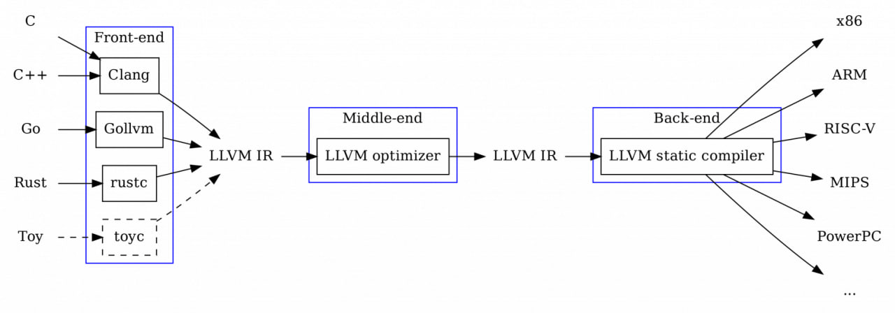
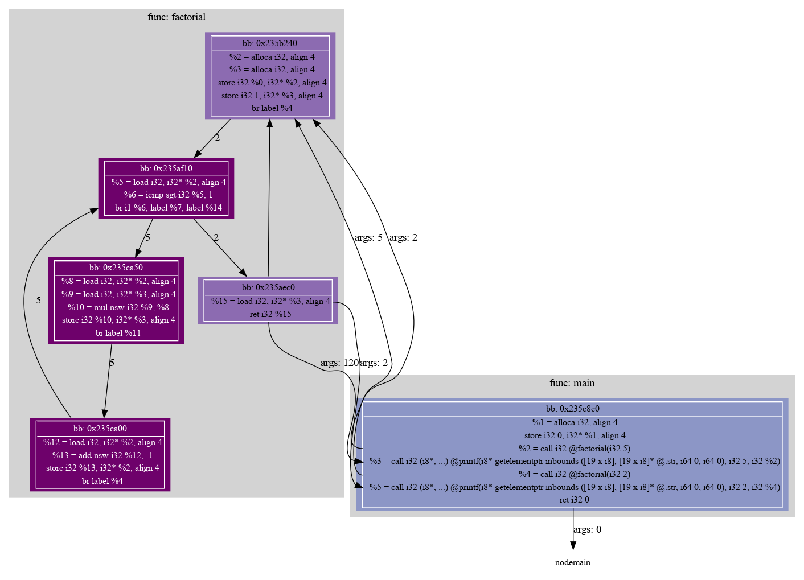

# LLVM Pass
## About this work
### What is LLVM IR?
**LLVM IR** is an intermediate representation used by the LLVM compilation framework. It allows you to perform various manipulations with the code, *abstracting* from the *architecture* of the device on which the code will be executed, and from the *programming language* in which this code was written.

LLVM IR is the middle-end stage of compilation:


### What is LLVM Pass?
**LLVM Pass** is a software component in LLVM that performs analysis or transformation of the program code presented in the IR format used in LLVM.

### My LLVM Pass
In this work, I implemented my own LLVM Pass, which performs **static** and **dynamic** program analysis.

**Static analysis** collects:
- basic block IDs;
- basic block instructions;
- function name.

**Dynamic analysis** collects:
- functions execution order;
- basic blocks execution order;
- function return value;
- arguments passed in the call function.

The **static** analysis file (`static.txt`) has a similar structure:
```
function <name_func>
bb <bb_ID>
  // llvm ir instructions
function <name_func>
bb <bb_ID>
  // llvm ir instructions
....
```

The **dynamic** analysis file (`dynamic.txt`) has a similar structure:
- if the base block in the function is being read
```
<func_name> <bb_ID>
factorial 0x15e6250
```
- if another function is called
```
call <caller_function> -> <callee_function> <bb_ID> <call_instr_line_in_bb_ID> <arg>
call main -> factorial 0x15e78f0 2 5
```
- if there is a return from the function
```
ret <func_name> <bb_ID> <ret_instr_line_in_bb_ID> <ret_value>
ret factorial 0x15e5ed0 1 120
```

## Build
### Requirements
1. LLVM package (Ubuntu: `sudo apt install llvm`)
2. GNU Make
3. Graphviz

### Build
1. Compile the project to generate a static analysis file (`static.txt`):
```
make
```
If successful, you will see:
```
Directory build does not exist.
Creating shared library...
Building your programm...
Done!
```
If this is not the first time you compile, then:
```
Creating shared library...
Building your programm...
Done!
```
2. Run the exec file (`dynamic.txt`) to generate the dynamic translation code:
```
./programm
```

If you want to get a **visual representation** of the executed program, then enter:
```
./vizualizer.sh
```
If you want to quickly **delete all** created files, then enter:
```
make clean
```

### Example
An example of the `factorial.c` program instrumentation:
